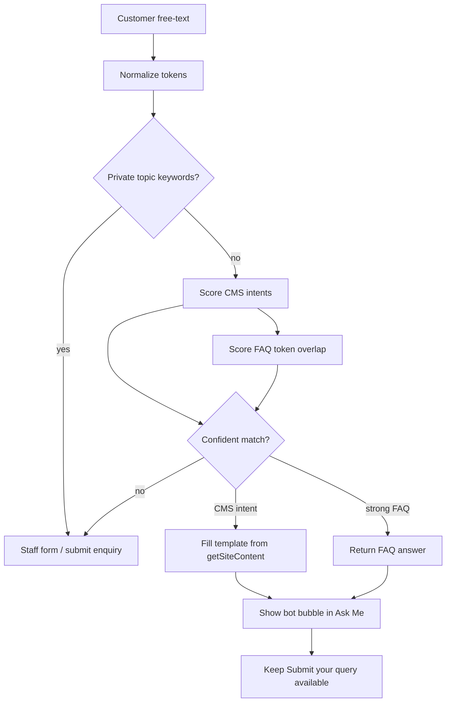

# Ask Me: data-driven auto answers (no AI) — future implementation plan

**Status:** Deferred — plan only; do not implement until explicitly requested.  
**Repo:** Action-Plus-Gym-Website  
**Product surface:** Public website **Ask Me** bot only (not Member Portal chat)  
**Decided:** Website Ask Me · staff handoff when unmatched  
**Related:** [DIET_WORKOUT_AUTO_ANSWER_PLAN.md](./DIET_WORKOUT_AUTO_ANSWER_PLAN.md)

---

## Goal

Answer common **new-customer** free-text questions automatically from **already-published CMS data**, without AI or subscriptions; if unsure, keep today’s staff enquiry handoff.

---

## Why this works without AI

You do not need language models to answer “What time do you open?” or “How much is a plan?”. Those answers already live in:

- `website_opening_hours`
- `website_pricing_plans`
- `website_services` / `website_trainers`
- `website_settings` (phone, WhatsApp, address, etc.)

A **keyword → intent → template** pipeline fills fixed reply text from those rows. Unmatched or private topics fall through to staff.

---

## What exists today (do not break)

| Piece | Path / RPC | Behaviour |
|-------|------------|-----------|
| Ask Me UI | `components/site/AskMeBot.tsx` | FAQ chips + free-text form |
| Server actions | `lib/actions/bot.ts` | FAQs, submit enquiry, get thread |
| FAQs | `website_bot_faqs` | Canned Q&A |
| Enquiries | `website_bot_submit_enquiry` | Staff inbox thread |
| CMS load | `lib/cms/get-site-content.ts` | Hours, pricing, services, trainers, settings |

Keep FAQ chips and staff inbox flow intact. Auto-answer is **additive**.

---

## Architecture

---

## Intents v1 (public-safe only)

| Intent | Example triggers | Answer source |
|--------|------------------|---------------|
| hours | open, timing, hours, close, schedule | `content.hours` + settings timezone |
| pricing | price, fee, plan, cost, membership | `content.pricing` (name + price only) |
| contact | phone, call, whatsapp, address, location, map | `website_settings` |
| services | PT, yoga, Zumba, class, facility | `content.services` |
| trainers | trainer, coach | `content.trainers` (public name/role only) |
| visit / trial | trial, visit, join, how to join | Fixed template + link to contact / lead |

### Never auto-answer (always handoff)

- Member PIN / login / biometric / portal
- Bill date, payment due, fine, overdue, attendance
- Another member’s data or staff-only ops

---

## Confidence rules (strict)

1. Normalize: lowercase, strip punctuation, collapse whitespace; tokenize.
2. Score each intent by keyword / phrase hits.
3. Accept only if top score ≥ threshold, clearly ahead of runner-up, and required CMS data is non-empty.
4. Else strong FAQ overlap only.
5. Else → staff handoff.
6. Templates only — no free-form generation.

---

## Implementation checklist (when approved)

1. **Engine** — `lib/bot/auto-answer.ts` (new): `normalizeQuery`, `matchAutoAnswer`
2. **Action** — `tryBotAutoAnswerAction` in `lib/actions/bot.ts` using `getSiteContent()` + FAQs
3. **UI** — `AskMeBot.tsx`: free-text tries auto-answer first, else existing form
4. **Tests** — hours/pricing/contact match; private topic → null; empty CMS → handoff
5. **Optional:** prefix `[auto:hours]` on later staff submit for context

---

## Safety / non-goals

- No AI, embeddings, vector DB, or paid APIs
- No Member Portal chat in this phase
- No membership / payment / attendance lookups for anonymous visitors
- No Gym Manager payment/member write-path changes
- Read public CMS only

---

## Manual test plan (before ship)

- “What time do you open?” → hours from CMS
- “How much is monthly plan?” → pricing from CMS
- “My PIN / bill date / portal login” → staff form
- Empty CMS pricing → handoff
- FAQ chips and submit rate limit still work

---

## Trigger to implement

Only start coding when product explicitly asks to **implement the Ask Me data auto-answer plan**.
