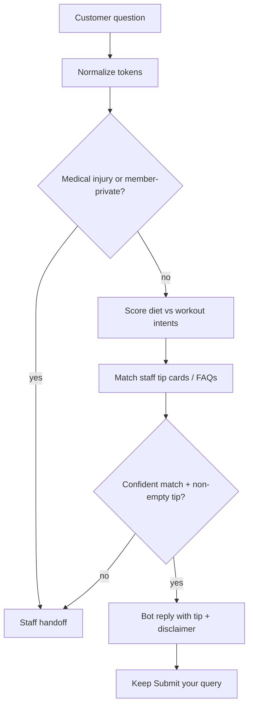

# Diet & workout auto answers (no AI) — future implementation plan

**Status:** Deferred — plan only; do not implement until explicitly requested.  
**Repo:** Action-Plus-Gym-Website  
**Companion plan:** [ASK_ME_DATA_AUTO_ANSWER_PLAN.md](./ASK_ME_DATA_AUTO_ANSWER_PLAN.md) (hours / pricing / contact from CMS)  
**Constraints:** No AI, no paid APIs/subscriptions; no inventing medical or training advice at runtime.

---

## Goal

Answer common **diet** and **workout** questions automatically from **staff-authored tip/FAQ content** (and later each member’s assigned plan), without AI. If unsure, keep today’s **staff handoff**.

---

## Decisions (aligned with Ask Me “same plan”)

- **Surface v1:** Website **Ask Me** (public new customers)
- **Fallback:** Staff handoff when no confident match
- **Answers only from staff-authored data** — never generated text
- **Phase 2 (later):** Member Portal — answer from **that member’s assigned** diet/workout only

---

## Reality check

Unlike opening hours, “what should I eat?” / “what workout today?” is **personal**. Public CMS today does **not** contain per-person diet/workout. Without AI, v1 must use:

1. Staff-written tip cards (keyword → canned tip), and/or
2. Existing FAQ rows tagged as diet/workout, and/or
3. Phase 2: logged-in member’s `dietPlan` / workout assignment from `app/api/member/training/route.ts`

Do **not** invent macros, meal plans, or injury advice from thin air.

---

## Data available today

| Source | Use |
|--------|-----|
| `website_bot_faqs` | Can hold diet/workout Q&A (already wired to Ask Me chips) |
| Member training API | `dietPlan`, workout stubs, basic workout options — **member-authenticated only** |
| Gym Manager PT | Diet document uploads, workout plans — source of truth for Phase 2 |
| Basic workout chips | Settings `basic_workout_options` / exercise types — labels only, not full programs |

---

## Approach (deterministic, same engine as CMS auto-answer)

Reuse the Ask Me auto-answer architecture; add **diet** and **workout** intents that only fire when tip/FAQ content exists.

### Intents v1 (Ask Me)

| Intent | Example triggers | Answer source |
|--------|------------------|---------------|
| diet_tip | eat, diet, food, protein, meal, nutrition | Staff tip card / FAQ in diet category |
| workout_tip | workout, exercise, training, gym routine, chest day | Staff tip card / FAQ in workout category |
| pt_offer | personal trainer, PT, coach me | Short template → contact / lead (from settings) |

### Never auto-answer

- Medical conditions, injury rehab, “is this safe for…”, pregnancy, supplements dosing
- Member PIN, billing, attendance
- Personalized macros/calories without an assigned plan on file

Always append a fixed disclaimer, e.g. *“General tip only — ask your trainer for a plan that fits you.”*

---

## Implementation outline (when approved)

### Phase 1 — Website Ask Me (ships with or after hours/pricing engine)

1. **Content model (prefer least schema churn)**
   - **Preferred:** Extend FAQs with optional `category` (`general` \| `diet` \| `workout`) on `website_bot_faqs` + admin Messages/FAQ UI filter
   - **Alt:** New table `website_bot_tip_cards` (title, keywords[], body, category, is_active) — only if FAQ category is too limiting

2. **Engine** — extend `lib/bot/auto-answer.ts` (from companion plan)
   - `diet_tip` / `workout_tip` intents
   - Match keywords against tip/FAQ question + optional keyword list
   - Same confidence gate; empty library → handoff

3. **Action / UI** — same as companion plan (`tryBotAutoAnswerAction`, `AskMeBot` free-text path)

4. **Admin** — staff add diet/workout FAQs or tip cards in Messages/FAQ board (`components/admin/MessagesBoard.tsx`); no AI generation in admin

5. **Tests** — protein tip matches diet FAQ; injury question → handoff; empty tips → handoff

### Phase 2 — Member Portal (personal, safer)

1. After login, Training helper: diet/workout questions return **their** `dietPlan` / assigned workout text from training API only
2. If no plan assigned → “Your trainer hasn’t assigned a plan yet” + handoff/chat
3. Never cross-member data; branch/staff rules unchanged

---

## Safety / non-goals

- No AI meal generators, calorie estimators, or form checkers
- No rewriting PT diet documents
- No payments / portal-auth / Gym Manager write-path changes
- Public bot must not expose another member’s plan
- Display / template only

---

## Relationship to companion plan

| Plan | Answers from |
|------|----------------|
| Ask Me data answers | Live CMS (hours, pricing, contact, services) |
| **This plan** | Staff diet/workout tips (+ later member’s own plan) |

Share one `matchAutoAnswer` module; add intents and content sources here.

---

## Manual test plan (before ship)

- Staff adds FAQ “High protein foods?” → Ask Me free-text returns that answer + disclaimer
- “What workout for chest?” → workout tip FAQ if present
- “I have chest pain / injury” → no auto answer → staff form
- No diet FAQs in DB → handoff (no invented meals)
- Existing hours/pricing intents still work
- FAQ chips still work

---

## Trigger to implement

Only implement when product explicitly asks to build **diet/workout auto-answer** (preferably after or with the Ask Me CMS auto-answer engine). Until then this document is the source of truth.
