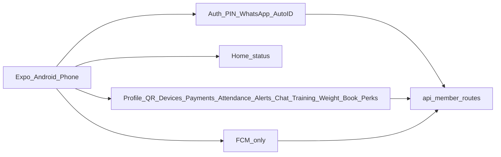

# Member Portal — Android phone app first (future implementation plan)

**Status:** Deferred — plan only; do not implement until explicitly requested.  
**Priority lock:** **Android phone first.** iOS / tablets are **Phase 5+** (after Android Play release is stable).  
**Repo today:** Action-Plus-Gym-Website Member Portal (`/members`)  
**Goal:** Same Member Portal functionality on an **Android phone** app, reusing existing APIs.

---

## Recommended approach (locked)

**Expo (React Native)** Android app that calls existing **`/api/member/*` APIs**.

| Layer | Android v1 choice |
|-------|-------------------|
| UI | RN screens mirroring portal home tiles & panels (phone layout) |
| Backend | Reuse production Member Portal APIs |
| Auth | Add **Bearer JWT** (web cookies stay for `/members` site) |
| Push | **FCM only** (defer APNs until iOS) |
| Biometrics | Android fingerprint / biometric prompt |
| Attendance QR | Native **camera** scan |
| Target devices | **Phones** (portrait); tablet layout later |

**Out of scope until Android ships:** iOS App Store, TestFlight, APNs, iPad layout, multi-gym white-label, Gym Manager staff app.

---

## Why Android first

- Lower entry cost (Play **$25 once** vs Apple **$99/year**)
- Faster push setup (FCM only)
- No Apple review demo-account friction on day one
- Same Expo codebase can add iOS later with less rewrite

---

## Feature parity (Android phone = web portal)

| Area | Web today | Android phone |
|------|-----------|---------------|
| Auth | WhatsApp / auto-identity + PIN + trusted devices (max 3) | Same; device id in Keystore |
| Biometric | WebAuthn | Android biometric unlock |
| Home | Status, plan, remaining, next payment, branch | Same from `/me` |
| Profile / QR / Devices / Payments | As web | Same |
| Attendance | Month + paste claim token | Month + **camera scan** |
| Alerts | In-app + Web Push | In-app + **FCM** |
| Chat / Training / Weight / Book / Perks | As web | Same APIs |
| Section flags | Staff hide tiles | Honor `portal_sections` |

---

## Architecture (Android first)



---

## Phased delivery

### Phase 0 — Prerequisites (Android only)

No app code until these exist:

1. **Google Play Console** ($25 one-time)
2. App name + Android `applicationId` (e.g. `com.actionplusgym.member`)
3. Support + privacy policy URLs
4. App icon (1024²) + Android adaptive icon layers + splash colors
5. Production + staging portal URLs
6. Test members (Active, Hold, PIN, WhatsApp flow)
7. Confirm single gym (`GYM_ID`) for v1
8. **Firebase project** for FCM (create or share access)
9. WhatsApp staff onboarding on mobile? **Recommended: yes** (same as web)
10. Phone-first; attendance camera scan: **yes**

**Not needed yet:** Apple Developer, APNs `.p8`, iOS bundle ID, TestFlight demo account.

### Phase 1 — API readiness (Website, additive)

- Bearer access/refresh tokens on member APIs (cookies unchanged for web)
- Mobile login returns tokens for secure Android storage
- Native push registration: `platform=android` + FCM token
- Attendance claim token works from scanned QR payload
- No payment/member write-path rewrites

### Phase 2 — Android MVP (phone)

- Auth → PIN → home
- Home, Profile, QR, Devices, Logout
- Payments + receipt share
- Honor section visibility

### Phase 3 — Android full parity (phone)

- Attendance camera, Chat, Alerts + FCM
- Training, Weight, Bookings, Perks, biometric
- Welcome, NEW badges, chat unread

### Phase 4 — Play Store release

- Play listing, screenshots (phone), internal/closed testing → production
- Privacy labels / Data safety form

### Phase 5 — iOS later (deferred)

- Apple Developer ($99/year), APNs, iOS bundle ID
- Enable iOS target in same Expo app
- TestFlight → App Store (demo PIN for review)

---

## Suggested project layout (when started)

```
member-portal-mobile/     # Expo app
  app/                    # screens (phone-first)
  src/api/                # /api/member client
  src/auth/               # secure token storage (Android Keystore)
```

Build/submit **Android only** until Phase 5.

---

## Cost focus (Android-first)

| Item | Cost |
|------|------|
| Google Play | **US $25** one-time |
| Firebase FCM | Usually **$0** at gym volume |
| Expo free tier | Usually enough to start |
| Apple / APNs | **$0 until Phase 5** |
| Development | Your time (with agent) or outsourced build — Android-only is cheaper/faster than dual-platform |

Year-1 hard fees for Android-only publish: about **US $25** (+ optional Expo paid if you outgrow free builds).

---

## Rough effort (Android phone only)

| Phase | Calendar |
|-------|----------|
| Phase 1 API | 1–2 weeks |
| Phase 2 MVP | 3–4 weeks |
| Phase 3 parity | 3–5 weeks |
| Phase 4 Play | 1–2 weeks |

Often **~2–3 months** to Play-ready, then iOS as a follow-on.

---

## Risks & safety

- Token auth must not break web portal cookies
- FCM ≠ Web Push (separate Android pipeline)
- No AI; no payment recording changes; portal gates stay server-side
- Max 3 trusted devices; no cross-member data

---

## Trigger to implement

Start when Phase 0 Android items are ready and you explicitly ask to **implement the Android Member Portal app**.
